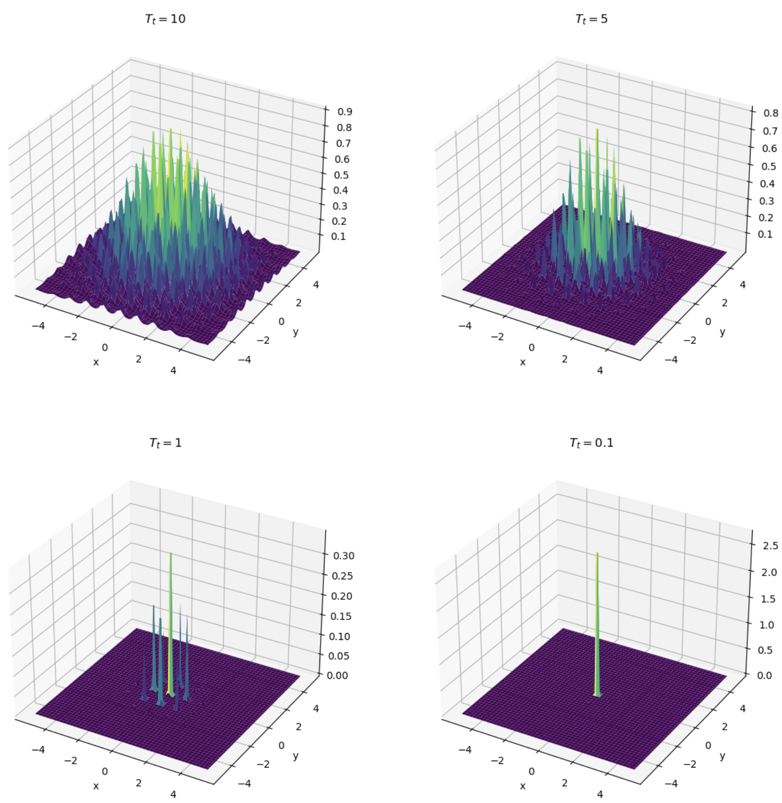

    
        [Back](javascript:window.history.back())
    
    
        **Updated:** `r Sys.Date()`
    
    
        Statistical Simulation, Wei Li
    

<!------------->

# Global strategies

Some algorithms have been developed as attempts to find the global minimum of a smooth target function. We discuss two here: stochastic local search and simulated annealing. There two algorithms provide no absolute guarantee for finding the global minimum, but are less likely to get stuck in the local minima.

### Stochastic Local Search

Recall the basic gradient descent
$$
w_{t+1} \leftarrow w_t -\alpha_t \nabla L(w_t), \quad \alpha_t>0.
$$
The general idea for stochastic gradient descent (local search) is that we move $w_t$ to $w_{t+1}$ in a random direction, say $w_{t+1} \leftarrow w_t + \epsilon_t$, for some random $\epsilon_t$. Consider the finite-difference approximation
$$
\tilde{\nabla} L(w_t) = \frac{L(w_t+\beta_t \eta_t)- L(w_t-\beta_t \eta_t)}{2 \beta_t} \eta_t:=\frac{\Delta L(w_t, \beta_t \eta_t)}{2\beta_t}\eta_t,
$$

We set $\{\beta_t\}$ decreasing to $0$. Note that $\lim_{\beta_t\to0} (\Delta L(w_t, \beta_t \eta_t)/2\beta_t)=\nabla_{\eta_t}L(w_t)=\inner{\nabla L(w_t)}{\eta_t}$ the directional derivative of $L$ along the direction $\eta_t,$ for example,

- $\eta_t$ uniformly distributed over the unit sphere $\|\eta\|=1$, say on $\mathbb{R}^2$, take $w_1 \sim N(0,1), w_2\sim N(0,1)$ and define $\eta_1=w_1/\sqrt{w_1^2+w_2^2}, \eta_2=w_2/\sqrt{w_1^2+w_2^2}.$

The update is 
$$
w_{t+1} \leftarrow w_t-\alpha_t \tilde{\nabla} L(w_t).
$$

When the value of $\beta_t$ is large, the process doesn't follow the steepest descent in $w_t$ but instead takes a more random path. This random exploration in the early phases helps avoiding getting trapped in some potential local minima. As time goes on, the update direction satisfies descent direction almost certainly but it is still randomly perturbed. It is crucial to have some step length $\alpha_t$ to moderate the descent.

The choice of $\alpha_t, \beta_t$:

- $\alpha_t$ decreases slowly to $0$; $\beta_t$ decreases more slowly than $\alpha_t$
- $\sum_{t} \alpha_t =\infty$
- $\sum_{t}(\alpha_t/\beta_t)^2 <\infty$, e.g., $\alpha_t=1/(t+1)$, $\beta_t=1/(t+1)^{0.1}$

### Simulated Annealing

In metallurgy, annealing refers to the process where a solid is heated to release its thermal stresses, and then cooled slowly to allow its crystals to arrange in a configuration that minimizes energy. The quality of the end result, i.e., the arrangement of the crystals, is dependent on the rate of cooling. Faster cooling may trap the material in a sub-optimal configuration, whereas slow cooling is more likely to result in a configuration closer to the global minimum energy state.

Consider maximize $h(\theta)$ (global maximization):

Assume $h: \Theta \mapsto \mathbb{R}, \int_H h(\theta)<\infty$.

Define the so-called Boltzman-Gibbs transformation of $h$ to be 
$$\pi_t(\theta) = exp \Big(\frac{h(\theta)}{T_t}\Big),$$ 
where $T_t>0$ is the temperature at time $t$.

One can treat $\pi_t(\theta)$ as some unnormalized version (i.e., the kernel) for the density function of $\theta$.

As $T_t \downarrow$ 0, the kernel of density will become more and more concentrated in a narrower neighborhood of the maximizer of $h$.

**example**: The following is the plot of $\exp \left(\frac{h(\theta)}{T_t}\right)$, where $h$ is two dimensional Rastrigin function: $-(2A+\sum_{i=1}^2\left[x_i^2-A \cos \left(2 \pi x_i\right)\right])$ where $A=10$ and $x_i \in[-5.12,5.12]$:

{ width=60% }

**Algorithm (Metropolis-Hastings)**:

Suppose $g(\cdot)$ symmetric density function $g(-x)=g(x)$, e.g. $N(0,1)$.

1. simulate $\zeta^{(t)}$ from $g$.

2. generate $\theta^{(t+1)}$ as
$$\theta^{(t+1)}=
\begin{cases}
\theta^{(t)}+\zeta^{(t)} & \text{with } \ prob\ \rho=\min\{exp(\frac{\triangle h}{T_t}), 1\}, \triangle h = h(\theta^{(t)}+\zeta^{(t)})-h(\theta^{(t)})\\
\theta^{(t)} & \text{with }\ prob \ 1-\rho\\
\end{cases}.$$

3. reduce temperature $T_{t+1} \leftarrow T_t$. For example, one can let $T_t = 1/log(1+t)$ or $(1/1.2)^t.$

**Remarks**:

1. If the perturbation increases $h$ (i.e., $\triangle h\geq 0$), the new proposal is automatically accepted. If $\triangle h<0$, then still accept it with certain probability  $\rho(<1)$.

2. When $T_t$ is relatively large, many "bad" proposals (that is those $\triangle h<0$) may still be accepted. Therefore a larger part of the space can be explored. As $T_t \downarrow 0$, that will limit the "bad" proposal that we allow.

3. When $T_t$ is sufficiently small, one essentially "anneal" the process by accepting only "good" proposals (i.e., $\triangle h\geq 0$).

4. In step 2, one can instead sample $u\sim unif(0, 1)$, and if $u \leq \exp(\Delta h/T_t)$, we set $\theta^{(t+1)} \leftarrow \theta^{(t)} + \zeta^{(t)},$ otherwise, we $\theta^{(t+1)} \leftarrow \theta^{(t)}.$

5. If $T_t$ is fixed, the algorithm essentially draws a Markov Chain whose stationary distribution ig given by $\theta \propto \exp(h(\theta)/T)$.

The following is the plot of the function $\rho\left(T_t\right)$ against $T_t$, with $T_t$ decreasing from 10 to 0.1 and $\Delta h=-0.1$:

{ width=60% }

### Python Code Examples

Provided and discussed in lab.

<!------------->

    
        [Back](javascript:window.history.back())
    
    
        **Updated:** `r Sys.Date()`
    
    
        Statistical Simulation, Wei Li
    
