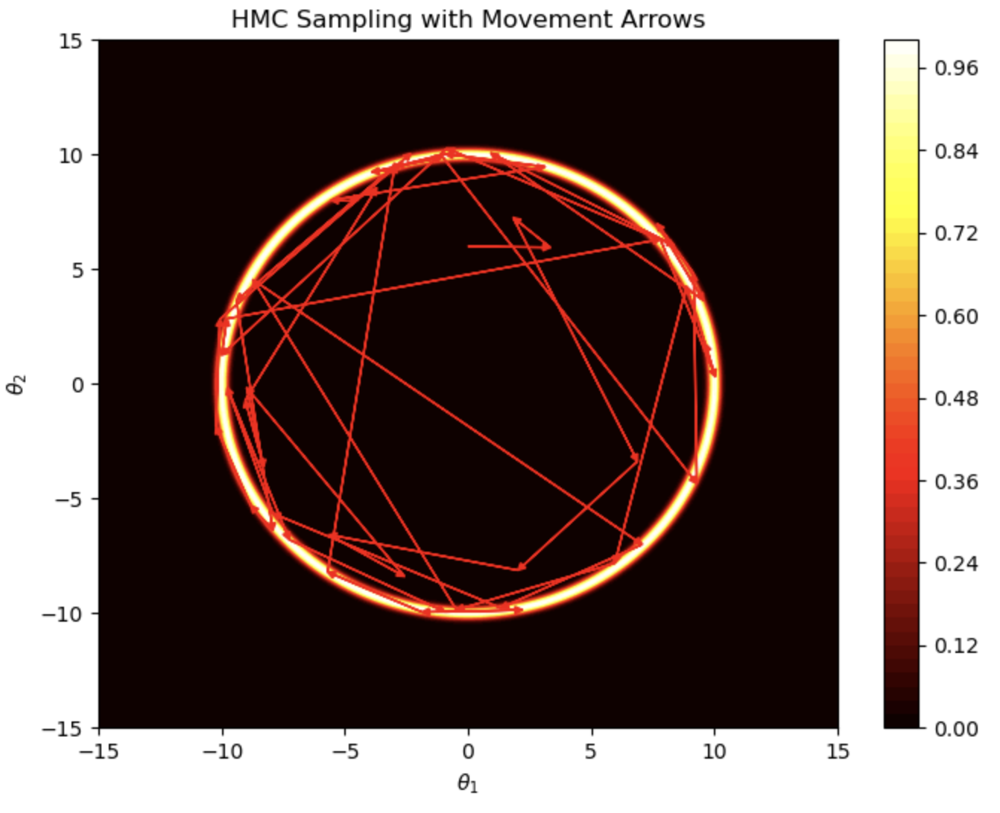

    
        [Back](javascript:window.history.back())
    
    
        **Updated:** `r Sys.Date()`
    
    
        Statistical Simulation, Wei Li
    

<!------------->

## Hamiltonian Monte Carlo

Hamiltonian Monte Carlo (HMC) is another powerful technique to sample from a probability distribution. It's especially effective for high-dimensional distributions. The main requirement for implementing HMC is the target density function being differentiable.

The basic idea behind Hamiltonian Monte Carlo is to use the concepts from Hamiltonian dynamics in physics to efficiently explore the target distribution. The system is described by a **Hamiltonian function** $H$, which is a sum of potential energy $U$ and kinetic energy $K$ :

$$
H(x, w) = U(x) + K(w).
$$
Here, $x \in \mathbb{R}^d$ represents the position (parameters of interest in the distribution we want to sample from), and $w \in \mathbb{R}^d$ represents the momentum (auxiliary variables) of the same dimension of $x$.

The potential energy $U(x)$ is typically the negative log of the target probability density (up to a constant), which is defined through the target density $p$ by 
$$
p(x)=\frac{1}{Z} \exp (-U(x)),
$$
where $Z$ is some normalizing constant. 

The kinetic energy $K(w)$ is often chosen to be a quadratic function of $w$, resembling the kinetic energy in physics, so $K(w)=K(-w)$. A common choice is that 
$$
K(w)=\frac{1}{2} w^{\top} \Sigma^{-1} w,
$$
for some p.d. $\Sigma$. This just means the momentum follows a multivariate normal distribution. A simple example is $\Sigma=\op{diag}(\sigma^2_1, \ldots, \sigma^2_d)$, so $K(w)=\sum_{i=1}^d (w_i^2/2 \sigma_i^2)$.

Effectively, we can think of the problem as sampling from the joint distribution of $(x, w)$ from 
$$
p(x, w) \propto \exp (-H(x, w))=\exp \left(-U(x)-\frac{1}{2} w^{\top} \Sigma^{-1} w\right),
$$
and the samples of $x$ then is from the marginal distribution of $x$.

**Hamiltonian dynamics**

**Hamilton's equations** describe how the state of the system $(x, w)=(x(t), w(t))$ changes over time. These equations are given by:
$$
\frac{dx}{dt} = \frac{\partial H}{\partial x}=\frac{\partial K}{\partial w}, \qquad \frac{dw}{dt} = -\frac{\partial H}{\partial x}=-\frac{\partial U}{\partial x}.
$$
These equations describe the rate of change of the position coordinates $(x)$ as determined by the partial derivative of the Hamiltonian with respect to the momentum coordinates $(w)$, and the rate of change of the momentum determined by the negative partial derivative of the Hamiltonian with respect to the position coordinates. 

Let $g: (x, w) \to (x^*, w^*)$ denote the transition under the Hamiltonian dynamics for a *fixed* period of time. Clearly, $g$ is deterministic. 

Hamiltonian dynamics have several key properties that are crucial for HMC:

- **Conservation of the Hamiltonian**: The value of $H$ remains constant along any trajectory.
$$
\frac{d H}{d t}=\sum_{i=1}^d\left[\frac{d x_i}{d t} \frac{\partial H}{\partial x_i}+\frac{d w_i}{d t} \frac{\partial H}{\partial w_i}\right]=\sum_{i=1}^d\left[\frac{\partial H}{\partial w_i} \frac{\partial H}{\partial x_i}-\frac{\partial H}{\partial x_i} \frac{\partial H}{\partial w_i}\right]=0.
$$
This conservation implies that if we are able to sample according to Hamilton's equations *perfectly*, then we remain on some fixed level curve of the Hamiltonian function. As will be clear later, this can hold only approximately with discretizing methods.
- **Reversibility**: The dynamic $g$ is 1-1 mapping and has an inverse which amounts to negating the momentum, then running the dynamic $g$, and lastly negating the momentum again. This property is crucial for the HMC to satisfy detailed balance condition (assuming the update is correctly done with adjustment for some Jacobian factor). 
- **Volume Preservation**: The determinant of the Jacobian matrix of $g$ has absolute value one, equivalently, the dynamic is volume-preserving in $(x ,w)$-space. That is, if we apply the mapping $g$ to the points in some region $R$ of $(x, w)$ space, with some volume, the image of $R$ under $g$ will also have the same volume.

##### Discretizing Hamilton's equations

Since the true solution for the Hamilton's equations is continuous, we are not able to simulate exact solutions, but have to reply on some discrete approximation. 

Earlier attempts are (1) Euler's method, (2) Modified Euler's method. Unfortunately, (1) does not preserve volume, and (2) involves asymmetric update which is not fully reversible. 

The most accurate method that respects the properties is the so-called **leapfrog integrator**, which is given by
$$
\begin{aligned}
w{(t+1 / 2)} & =w(t)-\frac{\epsilon}{2} \nabla U(x(t)), \\
x(t+1) & =x(t)+\epsilon \nabla K(w(t+1/2), \\
w(t+1) & =w(t+1 / 2)-\frac{\epsilon}{2}  \nabla U(x(t+1)).
\end{aligned}
$$
Here $\nabla U(x):= \partial U/\partial x, \nabla K(w):= \partial K/\partial w$. 

This one update consist of a half update of the momentum and one full update of the position, and lastly another half update of the momentum. 

Since a move from $(x , w)$ to $(x^*, w^*)$ will never conserve the Hamiltonian exatly due to the numerical approximation error by discretization, hence we would need to employ a Metropolis-Hastings step to decide whether to accept or reject the proposal $(x^*, w^*)$. Due to reversibility and the volume-preservation, the acceptance probability is simply
$$
\alpha=\min \left(1, \frac{p\left(x^*, w^*\right)}{p\left(x, w\right)}\right)=\min \left(1, \exp \left(-{H}\left(x^*, w^*\right)+{H}\left(x, w\right)\right)\right).
$$

We use subscript to denote the time: $x_t=x(t); w_t=w(t)$ in the description of the algorithms below.

**Hamiltonian Monte Carlo** for $t=0: T$ repeat the following

1. Generate random momentum $w_{t} \sim {N}({0}, {\Sigma})$.
2. Set $\left(x_0^{\prime}, w_0^{\prime}\right)=\left(x_{t}, w_{t}\right)$. Perform $L$ leapfrog updates moving from $(x_0^{\prime}, w_0^{\prime})$ to $(x^{*}, w^{*})$: 

   (1). Perform a half step update for momentum: $$w_{\frac{1}{2}}^{\prime}=w_0^{\prime}-\frac{\epsilon}{2} \nabla U\left(x_0^{\prime}\right);$$
   (2). $\text {For } l=1$ to $L-1,$ perform alternating one full step for $x$ and $w$:
$$
\begin{aligned}
& \qquad \begin{array}{l}
x_l^{\prime}=x_{l-1}^{\prime}+\epsilon \nabla K(w_{l-1 / 2}^{\prime}) \\
w_{l+1 / 2}^{\prime}=w_{l-1 / 2}^{\prime}-\epsilon \nabla U\left(x_l^{\prime}\right)
\end{array}
\end{aligned};
$$

   (3). Perform a full step update for location: $x_L^{\prime}=x_{L-1}^{\prime}+\epsilon \nabla K(w_{L-1 / 2}^{\prime})$; set $x^* = x_L^{\prime}$.
   
   (4). Perform a half step update for momentum: $w_L^{\prime}=w_{L-1 / 2}^{\prime}-\frac{\epsilon}{2} \nabla U\left(x_L^{\prime}\right)$;  set $w^* = - w_L^{\prime}$.
   
3. Compute 
$$\alpha=\min \left(1, \exp \left(-{H}\left(x^*, w^*\right)+{H}\left(x_{t}, w_{t}\right)\right)\right).$$
4. Set $x_{t+1}=x^*$ with probability $\alpha$, otherwise set $x_{t+1}=x_{t}$.

**Proof**: provided in class.

**Remarks**

- If $K(w)=\frac{1}{2} w^{\top} \Sigma^{-1} w$, then $\nabla K(w) = \Sigma^{-1}w.$
- In step 2 (4), if $K(w)=K(-w)$, we can just set $w^* = w_L^{\prime}$.
- Step length $\epsilon$ may be heuristically chosen by fixing $L=1$ and $\Sigma=I$ and experimenting different magnitudes of $\epsilon$ until the acceptance rate can settle between some acceptable range. It is also possible to use some scheduler to moderate the step length.
- One can choose $\Sigma$ by first running the chain for a burn-in period, then estimate $\Sigma$ by using sample covariance matrix of $x$.
- The number of leapfrog steps $L$ may be chosen using the so-called **no-U-turn sampler (NUTS)**.

#### Example

Suppose we want to sample from
\begin{align*}
\pi(\theta) \propto\exp \left(-20\left(\|\theta\|_2-10\right)^2\right).
\end{align*}

Because of the squared term $\left(\|\theta\|_2-10\right)^2$, the density has the radial symmetry and the concentric rings of high density around the points where the Euclidean norm is approximately 10.

{ width=60% }

## Langevin Monte Carlo

When we use $L=1$ and $K(w)=\frac{1}{2} w^{\top} \Sigma^{-1} w$ in Hamiltonian Monte Carlo, we have what is called **Langevin Monte Carlo**. It is also called Metropolis adjusted Langevin algorithm (**MALA**). 

For $t=0: T$ repeat the following

1. Generate random momentum $w_{t} \sim {N}({0}, {\Sigma})$.
2. Perform a full step update for location: 
$$x^*=x_{t}- \frac{\epsilon^2}{2}\Sigma^{-1}\nabla U(x_t)+\epsilon \Sigma^{-1} w_t;$$
3. Perform a half step update for momentum: 
$$w^*=w_{t}- \frac{\epsilon}{2}\nabla U(x_t)-\frac{\epsilon}{2} \nabla U\left(x^{*}\right);$$
4. Compute 
$$\alpha=\min \left(1, \exp \left(-{H}\left(x^*, w^*\right)+{H}\left(x_{t}, w_{t}\right)\right)\right).$$
5. Set $x_{t+1}=x^*$ with probability $\alpha$, otherwise set $x_{t+1}=x_{t}$.

### Python Code Examples

Provided and discussed in lab.

<!------------->

    
        [Back](javascript:window.history.back())
    
    
        **Updated:** `r Sys.Date()`
    
    
        Statistical Simulation, Wei Li
    

 