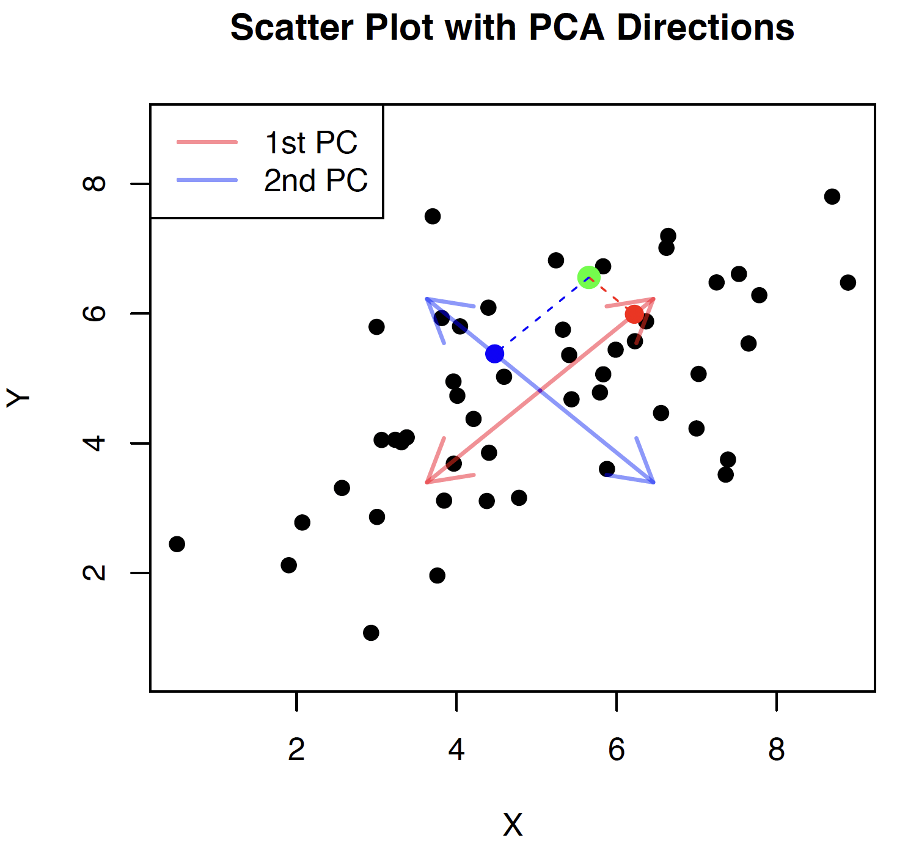

    
        [Back](javascript:window.history.back())
    
    
        **Updated:** `r Sys.Date()`
    
    
        Statistical Simulation, Wei Li
    

<!------------->

# PCA
The principal component analysis (PCA) is concerned with explaining the variance-covariance structure of ${X}=\left({X}_{1}, \cdots, {X}_{p}\right)^T$ through a few linear combinations of these variables.

Define the random vector and its mean vector
$$
X=\left(X_{1}, \cdots, X_{p}\right)^{T}, \quad \boldsymbol{\mu}=E(X)=\left(\mu_{1}, \cdots, \mu_{p}\right)^{T}.
$$
The variance-covariance matrix of $X$ is the
$$
\Sigma=\operatorname{Cov}(X)=E(X-\boldsymbol{\mu})(X-\boldsymbol{\mu})^{T},
$$
its $i j$ -th entry $\sigma_{i j}=E\left(X_{i}-\mu_{i}\right)\left(X_{j}-\mu_{j}\right)$ for any $1 \leq i \leq j \leq p$, 
where $\bs{\mu}$ is the population mean and $\Sigma$ is the population variance-covariance matrix. In practice, $\bs{\mu}$ and $\Sigma$ are unknown and estimated from the data.

Consider the linear combinations
\begin{align*}
Z_{1} &=\mathbf{v}_{1}^{T} {X}=v_{11} X_{1}+v_{21} X_{2}+\cdots+v_{p1} X_{p} \\
Z_{2} &=\mathbf{v}_{2}^{T} {X}=v_{12} X_{1}+v_{22} X_{2}+\cdots+v_{p2} X_{p} \\
\vdots &=\qquad \qquad \vdots \\
Z_{p} &=\mathbf{v}_{p}^{T} {X}=v_{1p} X_{1}+v_{2p} X_{2}+\cdots+v_{p p} X_{p}
\end{align*}
In a matrix form, 

$$
Z= V^T X,
$$
where $Z=(Z_1, \ldots, Z_p)^T$, $V=(\mb{v}_1, \ldots, \mb{v}_p)$. 
Then
$$
\begin{array}{l}
\operatorname{Var}\left(Z_{j}\right)=\mathbf{v}_{j}^{T} \Sigma \mathbf{v}_{j}, \quad j=1, \cdots, p, \\
\operatorname{Cov}\left(Z_{j}, Z_{k}\right)=\mathbf{v}_{j}^{T} \Sigma \mathbf{v}_{k}, \quad \forall j \neq k.
\end{array}
$$
Principal component analysis is a procedure that finds directions ($\mathbf{v}_{j}, j=1,\ldots,p$) such that $Z_{1}, \cdots, Z_{p}$ has maximum variability and also are linearly uncorrelated and uses these $Z_j$'s for subsequent statistical analysis. 

Principal components (PCs):

- The **principal components** of $X$ are (linearly) uncorrelated, linear combinations $Z_{1}, \cdots, Z_{p}$ whose variances are as large as possible.
- The collection $\{\mb{v}_1, \ldots, \mb{v}_p\}$ are called **principal directions** of $X$. Each entry in $\mb{v}_j$ is called a **PC loading** in the $j$-th direction. The magnitude of $v_{kj}$ measures the importance of the $k$ th variable to the $j$ th $\mathrm{PC}$, irrespective of the other variables. 

The procedure can be described as 

- The first $\mathrm{PC}=$ linear combination $Z_{1}=\mathbf{v}_{1}^{T} X$ that maximizes $\operatorname{Var}\left(\mathbf{v}_{1}^{T} X\right)$ subject to $\left\|\mathbf{v}_{1}\right\|=1.$
- The second $\mathrm{PC}=$ linear combination $\mathrm{Z}_{2}=\mathbf{v}_{2}^{T} \mathrm{X}$ that maximizes $\operatorname{Var}\left(\mathbf{v}_{2}^{T} X\right)$ subject to $\left\|\mathbf{v}_{2}\right\|=1$ and $\operatorname{Cov}\left(\mathbf{v}_{1}^{T} X, \mathbf{v}_{2}^{T} X\right)=0$.

- The $j$-th PC satisfies
\begin{align*}
\max & \operatorname{Var}\left(\mathbf{v}_{j}^{T} X \right) \\
\text { subject to } &\left\|\mathbf{v}_{j}\right\|=1 \\
& \operatorname{Cov}\left(\mathbf{v}_{l}^{T} X, \mathbf{v}_{j}^{T} X \right)=\mathbf{v}_{l}^{T} \Sigma \mathbf{v}_{j}=0 \\
& \text { for } l=1, \ldots, j-1
\end{align*}
where $j=2, \cdots, p$.

It turns out such a matrix $V$ can be found using eigen-decomposition of $\Sigma$: assume $\Sigma$ has $p$ eigenvalue-eigenvector pairs $(\lambda, \mb{v})$ satisfying:
$$
\Sigma \mb{v}_{j}=\lambda_{j} \mb{v}_{j}, \quad j=1 \cdots, p
$$
where $\lambda_{1} \geq \lambda_{2} \geq \cdots \geq \lambda_{p}\geq 0$ and $\left\|\mb{v}_{j}\right\|=1$ for all $j .$ This gives the following spectral decomposition

\begin{align*}
\Sigma=\sum_{j=1}^{p} \lambda_{j} \mb{v}_{j} \mb{v}_{j}^{T} = V 
\left[\begin{array}{cccc}
\lambda_1 & 0 & \cdots & 0 \\
0 & \lambda_2 & \cdots & 0 \\
\vdots & \vdots & \ddots & \vdots \\
0 & 0 & \cdots & \lambda_p
\end{array}\right]V^T.
\end{align*} 

- The $j$ th $\mathrm{PC}$ is given by $Z_{j}=\mb{v}_{j}^{T}{X}$ and its variance is
$$
\operatorname{Var}\left(Z_{j}\right)=\mb{v}_{j}^{T} \Sigma \mb{v}_{j}=\lambda_{j},
$$
$$
\operatorname{Cov}\left(Z_{j}, Z_{k}\right)=\mathbf{v}_{j}^{T} \Sigma \mathbf{v}_{k} = 0, \quad j \neq k.
$$

We may view $X$ is a function of $Z$. Since $V$ is orthogonal matrix, we also have $X=VZ$, therefore, 
$$
X=\sum_{k=1}^p \mb{v}_{k}Z_k,
$$
where each $Z_k$ can be viewed the coordinate representation of $X$ in the coordinate system given the columns of $V$.

Note also that $\op{Var}(X)=\sum_{j=1}^p \lambda_j \mb{v}_j \mb{v}^T_j$. So $\op{Cov}(X_s, X_t)=\sum_{j=1}^p \lambda_j v_{sj} v_{tj}$. Similarity of the PC loadings for the first few components between different $X_j$'s can be heuristically viewed as a degree of linear association. Note $\op{Cov}(X, Z)=V\op{Var}(Z)=[\lambda_1 \mb{v}_1, \ldots, \lambda_p \mb{v}_p]$, variables $X_j$'s that are correlated with the first few principal components are the most important in explaining the variability in the data set.

Note $\op{Var}(X_i)=\sum_{j=1}^p\lambda_jv_{ij}^2$. The square of the loading value represents the variance of the variable explained by the principal component, can be heuristically understood to be the importance of the variable.
The contribution of the variable $X_i$ to the $j$-th component can be measured by 
$v_{ij}^2/\sum_{i=1}^pv_{ij}^2=v_{ij}^2$. The contribution of $X_i$ in accounting for variation in the first $l$ component can be measured by 
$(\sum_{j=1}^l \lambda_{j} v_{ij}^2)/(\sum_{i=1}^p\sum_{j=1}^l \lambda_j v_{ij}^2)= (\sum_{j=1}^l \lambda_{j} v_{ij}^2)/ (\sum_{j=1}^l \lambda_j).$

## With data

Suppose we have ${X}_{i}=\left(X_{i 1}, \cdots, X_{i p}\right)^{T}$ for $i=1, \cdots, n$
If $\Sigma$ is unknown, we use sample vcariance $S_{n}$ as its estimator.
\begin{align*}
\mathbf{X}=\left[\begin{array}{c}
\bs{x}_{1}^{T} \\
\bs{x}_{2}^{T} \\
\vdots \\
\bs{x}_{n}^{T}
\end{array}\right]
=
\left[\begin{array}{c}
\mb{x}_{1},\mb{x}_{2} \cdots \mb{x}_{p}
\end{array}\right],
\end{align*}
$$
S_{n}=\frac{1}{n-1} \mb{X}_{c}^{T} \mb{X}_{c}=\frac{1}{n-1} \sum_{i=1}^{n}\left({X}_{i}-\overline{{X}}\right)\left({X}_{i}-\overline{{X}}\right)^{T},
$$
where $\mb{X}_{c}$ the centered design matrix of $\mb{X}$.

There are two ways to find $V=(\mb{v}_1, \ldots, \mb{v}_p)$:

- eigen-decomposition of $\mb{X}_{c}^{T} \mb{X}_{c}$: $\mb{X}_{c}^{T} \mb{X}_{c}=VD^2V^T$
- singular value decomposition $(\mathrm{SVD})$ of $\mb{X}_{c}$: $\mb{X}_{c}=UDV^T$.
- $D=\op{diag}(\text{singular values of } \mb{X}_c)=\op{diag}(\text{eigenvalues of } \mb{X}_c^T\mb{X}_c)$

Specifically, in the following discussion, suppose we have $n \times p$ demeaned data matrix $\mb{X}$ with $n \geq p$ (**we assume $\mb{X}$ it to be in mean-deviance form $\mb{X}_c$**), by the full SVD (or use thin SVD):

- ${V}=\left(\mathbf{v}_{1}, \mathbf{v}_{2}, \cdots, \mathbf{v}_{p}\right)$ is an $p \times p$ orthogonal matrix. $\mathbf{v}_{j}, j=1, \cdots, p,$ form an orthonormal basis for the space spanned by the row vectors of $\mathbf{X}$. The columns of ${V}$ (i.e., $\left.\mathbf{v}_{j}, j=1, \cdots, p\right)$ are the eigenvectors of $\mathbf{X}^{T} \mathbf{X}$. We call $\mb{v}_j$ the $j$-th **principal component direction** of $\mb{X}$.
- ${D}$ is a $n \times p$ rectangular matrix with nonzero elements along the first $p \times p$ submatrix diagonal. $\operatorname{diag}\left({d}_{1}, {d}_{2}, \cdots, {d}_{p}\right), {d}_{1} \geq {d}_{2} \geq \cdots \geq {d}_{p} \geq 0$ are the singular values of $\mathbf{X}$, or square roots of the eigenvalues of $\mathbf{X}^T \mathbf{X}$.
    - the number of nonzero $d_j$ is equal to the rank of $\mb{X}$.

Now, we project each row $\bs{x}_i$ of $\mb{X}$ onto the first PC direction $\mb{v}_{1}$ to obtain $z_{i1}=\mb{v}_{1}^T\bs{x}_i$. By collecting $\{z_{i,1}\}_{i=1}^n$,  we can form a column vector $\mb{z}_{1}$ the **first principle components of $\mb{X}$**, 
We do this for the second, third, .. and the $p$-th PC direction: 
$$
\textbf{the j-th principle component: } \qquad \mb{z}_j= \mb{X} \mb{v}_j \qquad (n \times 1) , \qquad j=1, \cdots, p
$$
where the $i$-th entry $z_{ij}=\mb{v}_{j}^T\bs{x}_i$ is called the **i-th score of the j-th PC of $\mb{X}$**. The scores indicate how each observation projects onto the principal components. The contribution of an individual $i$-th case to the $j$-th principal component can be assessed by $z_{ij}^2/\sum_{k=1}^nz_{kj}^2$.

In a data matrix form, we have $\mb{Z}=\mb{X}V,$
where
\begin{align*}
\mathbf{Z}=
\left[\begin{array}{c}
\mb{z}_{1},\mb{z}_{2} \cdots \mb{z}_{p}
\end{array}\right] 
= \left[\begin{array}{c}
\bs{z}_{1}^{T} \\
\bs{z}_{2}^{T} \\
\vdots \\
\bs{z}_{n}^{T}
\end{array}\right].
\end{align*}

Note the $p \times 1$ vector $\bs{z}_{i}=V^T \bs{x}_i$ is the **$i$-th score of the principal components** of $\mb{X}$, $i=1, \cdots, n$. 

**Geometric meaning**: By $V$ being a orthogonal matrix, $\bs{x}_i=V\bs{z}_i$, so $\bs{z}_{i}$ can be viewed as the new coordinate values of $\bs{x}_i$ in the p-dimensional coordinate system given by $V$ instead of $[e_1,\ldots,e_p]$.

{ width=60% }

 It is easy to show that principal components $\mathbf{z}_{j}$ have maximum variance $d_{j}^{2} / (n-1),$ subject to being orthogonal to the earlier ones.
 
- $\mb{z}_{1}=\mathbf{X} \mathbf{v}_{1}$ has the largest sample variance among all normalized linear combinations of the columns of $\mb{X}$.
- $\mb{z}_{2}=\mathbf{X} \mathbf{v}_{2}$ has the highest sample variance among all normalized liner combinations of the columns of $\mathbf{X}$, satisfying $\mathbf{v}_{2}$ orthogonal to $\mathbf{v}_{1}$ ($\bs{z}_{2}$ orthogonal to $\bs{z}_{1}$.)
- The last $\mathrm{PC}$ $\mb{z}_{p}=\mathbf{X} \mathbf{v}_{p}$ has the minimum sample variance among all normalized linear combinations of the columns of $\mathbf{X},$ subject to $\mathbf{v}_{p}$ being orthogonal to the earlier ones ($\bs{z}_p$ orthogonal to earliers PC's).
- ${U}=\left(\mathbf{u}_{1}, \mathbf{u}_{2}, \cdots, \mathbf{u}_{n}\right)$ is an $n \times n$ orthogonal matrix. $\mathbf{u}_{j}, j=1, \cdots, n,$ form an orthonormal basis for the space spanned by the column vectors of $\mathbf{X}$. 
  - For $d_j \neq 0$, $\mb{u}_j=\mb{z}_j/\| \mb{X}\mb{v}_j\| =\mb{X}\mb{v}_j/ d_j$--called **normalized j-th principal component**. 
  - The remaining $\mb{u}_j$'s that correspond to $d_j=0$ are just orthogonal extension to make $U$ a orthogonal matrix.

Remarks:

- PCs are solely determined by the covariance matrix $\Sigma$.
- The PCA analysis does not require a multivariate normal distribution.

Concerns:

- unsupervised learning
- ignore the response

#### The fraction of variance explained

Note the total variance of $\mb{X}$ is 
$$
\frac{1}{n-1}\op{tr}(\mb{X}^T\mb{X})=\frac{1}{n-1}\op{tr}(\mb{Z}^T\mb{Z})=\frac{1}{n-1}\sum_{j=1}^rd_j^2
$$
So the fraction of total varianc explained by the $j$-th PC $\mb{z}_j$ is $d_j^2/\sum_{j=1}^r d_j^2$.

#### Dimenstion reduction

One application for the principal components is the principal component regression: 

*Ordinary Least Square (OLS)*\
$\underset{\beta}{\text{min}}\|\mb{X}\beta-\mb{y}\|^2$

*Principal Components Regression (PCR)*\
$\underset{\theta}{\text{min}}\|\mb{Z}\theta-\mb{y}\|^2$

PCA technique is particularly useful when there is high multi-colinearity exists between the features/variables. By construction, the first principal component will contain the most information about the data, the subsequent principal components contain less and less information about the data while being uncorrelated. The first few principal components $\mb{z}_1,\mb{z}_2,\dots,\mb{z}_k$ $(k<p)$ can be used as predictors in lieu of the original set of all predictors in $X$. 

One particular drawback about $PCR$ is that the formation of the principal components for $X$ does not take into account any relationship between $X$ and $Y$. One remedy is the *Partial Least Squares* (PLS). Instead of focusing only on explaining the variance in \( \mathbf{X} \), PLS takes into account the response \( \mathbf{y} \). The PLS components are linear combinations of the original predictors, but they are chosen in a way that also explains variance in \( \mathbf{y} \).

The 1st-PLS component is $Z_1=\mb{v}_1^T X$ where $\mb{v}=(\op{corr}(X_1, Y), \cdots, \op{corr}(X_p, Y))^T$; 
The $j$-PLS ($j>2$) component $Z_j=\mb{v}_j^T X$ is obtained by finding the $j$-PLS directions $\mb{v}_j$ based on
\begin{align*}
\max & \operatorname{Var}\left(\mathbf{v}_j^T X\right) \op{Corr}^2(Y, \mathbf{v}_j^T X) \\
\text { subject to } & \left\|\mathbf{v}_j\right\|=1 \\
& \operatorname{Cov}\left(\mathbf{v}_l^T X, \mathbf{v}_j^T X\right)=\mathbf{v}_l^T \Sigma \mathbf{v}_j=0 \\
& \text { for } l=1, \ldots, j-1
\end{align*}

#### Latent factors

Assume $l \leq d$. We like to approximate each $\boldsymbol{x}_i \in \mathbb{R}^p$ with some possibly lower dimensional representation $\boldsymbol{z}_i \in \mathbb{R}^l$ or **latent factor**, so that $\bs{x}_i \approx \sum_{k=1}^l \mb{v}_{k}{z}_{ik}$, where each $\mb{v}_{k} \in \mathbb{R}^l$ and orthogonal to each other. Minimize $V$ in the following function over the restriction that $V$ has orthonormal columns
\begin{align*}
\mathcal{L}({V})=\frac{1}{n}\left\|\mathbf{X}-\mathbf{Z} {V}^{\top}\right\|_F^2=\frac{1}{n} \sum_{i=1}^n\left\|\boldsymbol{x}_i-{V} \boldsymbol{z}_i\right\|^2
\end{align*}
here $\| \cdot \|_F$ is Frobenius form, and the data matrix of latent factors $\mathbf{Z}$ each row contains the low dimension versions of the rows of $\mathbf{X}$. One can show that the optimal solution is obtained by setting $V=V_{1:l}$, where $V_{1:l}$ contains the $l$ eigenvectors with largest eigenvalues of the sample covariance matrix $S_n$. An interesting result is that this optimization problem is equivalent to the previous one we described for maximizing contrained variance. This is can be done using SVD low rank approximation. 

This problem may suggest that we can view PCA as a predictive model. However, , it does not usually make sense to use a lower-dimensional representation is approximate the variable. 

Note the objective function essentially is $\frac{1}{n}\left\|\mathbf{X}-\mathbf{X}V {V}^{\top}\right\|_F^2$ such that $V^TV=I$, so the error is just a kind of reconstruction error. The reconstruction is purely deterministic (fixing $V$ or estimated $V$): given $\mb{z}_i$, the $\mb{x}_i$ is fully determined. A probabilistic PCA is a probabilistic version of PCA that allows generation of $\mb{x}_i$: given $\mb{z}_i$, $\mb{x}_i$ can be generated according to some specified distribution.

<!------------->

    
        [Back](javascript:window.history.back())
    
    
        **Updated:** `r Sys.Date()`
    
    
        Statistical Simulation, Wei Li
    

