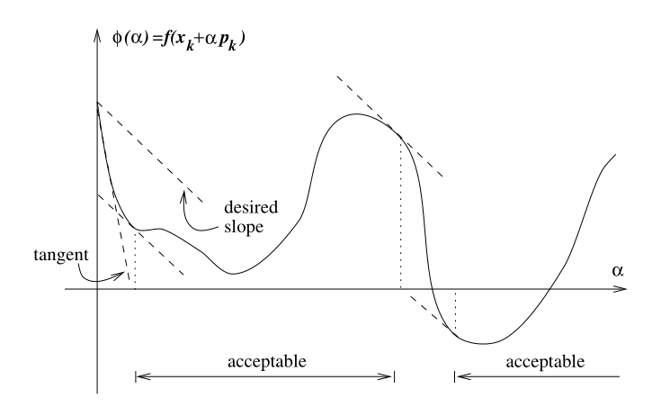

    
        [Back](javascript:window.history.back())
    
    
        **Updated:** `r Sys.Date()`
    
    
        Statistical Simulation, Wei Li
    

<!------------->

# Numerical method for optimization

For some smooth function $f$, consider $\min f(x) \rightarrow x^*$.

We'll consider the gradient method, and Newton's method (and its variants). Both methods guarantee that a stationary point of $f$ can be found (i.e. $\nabla f(x^*) = 0$). The basic idea is

1. start the process with some initial point $x_0$;
2. iterate steps $x_k \rightarrow x_{k+1}$ by going downhill.
3. repeat step 2 until the sequence of points converge to a stationary point.

For a general (non-convex) function, we run the procedure several times with different initial values $x_0$.

# Gradient descent
Choose a direction $p_k$ and search along the direction from the current iterate $x_k$ for a new iterate with lower function value $f(x_{k+1}) < f(x_k)$. Consider $x_k+\alpha P_k$ ( $\alpha$ = "step length", "learning rate",  $\alpha>0$ scalar) as the next iterate. 

Fix $\alpha$: Taylor approximation of $f$ at $x_k$ is given by
$$f(x_k +\alpha p) \approx f(x_k)+\alpha p^\top\nabla f(x_k):=T(x_k, \alpha p).$$
To solve for the direction $p$, $\min_{||p||=1} p^\top \nabla f(x_k)$, whose solution gives us the the unit direction that has the most rapid decrease in $f$. 

$p^\top\nabla f(x_k) = ||p|| \cdot ||\nabla f(x_k)|| cos(\theta)$, $0\leq \theta \leq \pi$
$\Rightarrow cos(\theta) = -1$ $\Rightarrow$ $p$ is the exact opposite direction of $\nabla f(x_k)$ , $p=\frac{-\nabla f(x_k)}{||\nabla f(x_k)||}.$

**Note**: Any $p_k$ such that $p_k^\top \nabla f(x_k)<0$ would work. It's called "descent direction".

## Algorithm
Gradient descent (fix $\alpha$), set $k = 0$, given $x_0$.

Repeat 

- $x_{k+1} \leftarrow x_k - \alpha \nabla f(x_k)$
- $k \leftarrow k+1$

Until stopping condition is met (e.g., $||\nabla f(x_k)||=0$).

# Newton's Method
Take a second order Taylor expansion of $T(x_k, \alpha p)$ in the direction given by $\alpha p$:
$$T(x_k,\alpha p):=f(x_k)+\alpha p^\top\nabla f(x_k)+\alpha^2p^\top\nabla^2f(x_k)p/2.$$
We travel to a stationary point of this quadratic approximation by solving for a minimizer $p$ (if $f$ is convex) and move $x_{k+1} \leftarrow x_k +\alpha p$. 

To see this, set $\alpha \equiv 1$; set the gradient of $T(x_k,\alpha p)$ to zero and solve for $p$: 
\begin{align*}
FOC: &\nabla_pT(x_k,\alpha p) \overset{set}{=} 0\\
&\nabla f(x_k) + \nabla^2f(x_k)p = 0\\
&\Rightarrow   p = p_k = -\nabla f(x_k)^{-1} \cdot \nabla f(x_k), \text{ if} \ \nabla^2f(x_k) \ \text{ is invertible}\\
&x_{k+1} \leftarrow x_k - \big[\nabla^2f(x_k)\big]^{-1} \cdot \nabla f(x_k).
\end{align*}

If $\nabla^2f(x_k)$ is not invertible, you can use $\big[\nabla^2f(x_k)\big]^\dagger$.
An alternative way is to solve: 
\begin{align*}
&\nabla f(x_k) + \nabla^2 f(x_k)(x_{k+1} - x_k) = 0.\\
\Leftrightarrow &\nabla^2f(x_k)x_{k+1} = \nabla^2f(x_k) x_k - \nabla f(x_k).\\
\Rightarrow &\text{solve for } x_{k+1}.\\
\end{align*}

**Remark:**
Newton method produces a sequence of points $x_1 , x_2, ...$ that minimizes a sequence of the function by repeatedly creating a quadratic approximation to the function $f$ centered at $x_{k}$. With a quadratic approximation more closely mimicking the object function. Newton method is often more effective than the gradient method. However, the reliance on the quadratic approximation makes Newton's method more difficult to use, especially for non-convex function. $\nabla^2f(x_k)$ may not be invertible, so can use $\big[ \nabla^2f(x_k) \big]^+$ or solving for $x_{k+1}$ from this system as above. However, both approaches do not guarantee that $p_k^\top \nabla f(x_k) < 0.$

#### Quasi Newton Method
\begin{align*}
  & p_k = -\big[\nabla^2f(x_k)\big]^{-1} \cdot \nabla f(x_k) \qquad \text{Newton Method}\\
  & p_k = -B_k^{-1} \nabla f(x_k) \qquad \text{Quasi -Newton  Method}
\end{align*}
here,  $B_k$ is some approximation to $\nabla^2f(x_k)$. Note that
\begin{align*}
  & \nabla f(x_{k+1}) = \nabla f(x_k) + \nabla^2f(x_k)(x_{k+1} - x_k) + o(||x_{k+1} - x_k||),\\
  & \Leftrightarrow \nabla^2f(x_k)(x_{k+1} - x_k) \small  \approx \nabla f(x_{k+1}) - \nabla f(x_k).
\end{align*}
 
$B_k$ is required to satisfy: (1). $B_k$ is symmetric; (2). $B_k(x_{k+1} - x_k) = \nabla f(x_{k+1}) - \nabla f(x_k)$ (secant equation).

Let $s_k= x_{k+1} - x_k$, $y_k = \nabla f(x_{k+1}) - \nabla f(x_k)$. If $B_0 >0$ and $s_k^\top y_k > 0$ (curvature condition), the BFGS update produces positive definite approximation to Hessian. The curvature condition is satisfied if the Wolfe conditions are imposed on the line search for the step length $\alpha_k$ (see below).

**BFGS**: The idea of BFGS method is to update $B_k$ using $B_{k+1}=B_k+\alpha {u} {u}^{\top}+\beta {v} {v}^{\top}$. Imposing the secant condition, $B_{k+1} {s}_k={y}_k$. Choosing ${u}={y}_k$ and ${v}=B_k {s}_k$, we can solve for $\alpha, \beta$:
\begin{align*}
\alpha=\frac{1}{{y}_k^\top {s}_k}, \qquad \beta=-\frac{1}{{s}_k^\top B_k {s}_k} .
\end{align*}
Then substitute $\alpha$ and $\beta$ back into $B_{k+1}=B_k+\alpha {u} {u}^{\top}+\beta {v} {v}^{\top}$ and get the update equation of $B_{k+1}$ :
\begin{align*}
B_{k+1} = B_k - \frac{B_ks_ks_k^\top B_k}{s_k^\top B_ks_k} +  \frac{y_ky_k^\top}{y_k^\top s_k}.\\ 
\end{align*}

**Alternative version of BFGS** 

Direct update the inverse of "Hessians" $B_k$: $p_k= -\tilde{B}_k \nabla f(x_k)$ where $\tilde{B}_k = B_k^{-1}:$
\begin{align*}
\tilde{B}_{k+1}=\left({I}-\frac{s_t {y}_k^{\top}}{{y}_k^{\top} {s}_k}\right) \tilde{B}_k\left({I}-\frac{{y}_k {s}_k^{\top}}{{y}_k^{\top} {s}_k}\right)+\frac{{s}_k {s}_k^{\top}}{{y}_k^{\top}{s}_k}.
\end{align*}

### Maximization Problem

Note: $\max f(x) = \min (-f(x))$

**Newton method**
$$
x_{k+1} \leftarrow x_k -   \big[\nabla^2f(x_k)\big]^{-1} \cdot \nabla f(x_k) \quad \text{ note: } \big[\nabla^2f(x_k)\big]^{-1} \text{is n.d. }
$$
**gradient descend method**
$$
x_{k+1} \leftarrow x_k - (-\nabla f(x_k))
$$

# Line Search

We now turn to the problem of how to find the step length: choose $\alpha$ assume $p_k$ has been found (say $p_k^\top \nabla f_k<0$). An ideal choice of $\alpha$ is find a global minimizer of
$$  
  \phi(\alpha) \equiv f(x_k + \alpha p_k), \quad \alpha > 0,
$$
but too costly. Instead, we use some inexact line search method to identify a step length that achieves adequate reduction in $f$.

#### Sufficient reduction condition(Armijo condition)
Let $l(\alpha)$ be the Taylor approximation of $\phi(\alpha)$ at $0$, so
$l(\alpha)=\phi(0)+ \alpha \phi'(0)=f(x_k)+ \alpha \nabla f(x_k)^\top p_k$, the idea is to choose some $\alpha$ so that $\phi(\alpha) \leq l(\alpha)$. More precisely, consider 
\begin{align*}
f(x_k + \alpha p_k) &\leq f(x_k) + c_1 \alpha \nabla f(x_k)^\top p_k,
\end{align*}
here, $c_1$ can be some small number, say $10^{-4}$. The condition says we need to choose $\alpha$ such that there is sufficient reduction in $\phi(\alpha)$, i.e., $\phi(\alpha) \leq l(c_1\alpha).$

{ width=60% }

##### Procedure (Backtracking line search)
choose $\bar{\alpha} > 0, \rho \in(0,1), c_1>0$.

Inside the $k$-th step of iteration, do
\begin{align*}
\text{ repeat until } &f(x_k + \alpha p_k) \leq f(x_k) + c_1\alpha p_k^\top \nabla f(x_k)\\
&\alpha \leftarrow \rho \alpha \\
\text{ end(repeat) }&
\end{align*}
When terminated, $\alpha_k \leftarrow \alpha$.

### Curvature condition

While the sufficient reduction condition ensures the step length decreases $f$ "sufficiently", it is possible that the step length is too small (or no sufficient reduction in the slope). To address this issue, often the curvature condition is imposed requiring $\alpha$:
$$
\phi'(\alpha)\equiv \nabla f(x_k+\alpha p_k)^\top p_k \geq c_2 \phi'(0)\equiv c_2 \nabla f(x_k)^\top p_k
$$
where $c_2 \in (c_1, 1)$, typically on the order of $0.1$. Note that the right hand side $f(x_k)^\top p_k<0$.

{ width=60% }

So if $\phi'(\alpha)<c_2\phi'(0)$, $\phi$ is still decreasing at $\alpha$, so we can improve the reduction in $f$ by taking a larger $\alpha$. If instead, $\phi'(\alpha)\geq c_2\phi'(0)$, then either we are close to a stationary point (minimum) where $\phi'(\alpha)=0$ or $\phi'(\alpha)>0$ which means we passed the stationary point.

This curvature condition, together with the Armijo condition are called the **Wolfe condition**.

**Note**: the Wolfe conditions can result in an $\alpha$ value that is not close to the minimizer of $\phi(\alpha)$. The **Strong Wolfe condition**
\begin{align*}
\left|\nabla f\left(x_k+\alpha p_k\right)^\top p_k \right| \leq c_2\left|\nabla f\left(x_k\right)^\top p_k \right|
\end{align*}
prevents the slope of $\phi(\alpha)$ from getting too large, hence excluding unlikely candidates that are far away from the stationary point.

#### Algorithm (BFGS with line search)

For the BFGS algorithm, the curvature condition in the line search guarantees the $s_k^\top y_k>0$ (simple check).

Let $x_0, \epsilon>0, \tilde{B}_0, k=0$
\begin{align*}
&\text{ while } ||\nabla f(x_k)||>\epsilon:\\
& \qquad \text{compute} \ p_k = -\tilde{B}_k\nabla f(x_k)\\
& \qquad  \text{line search with Wolfe condition} \ for \ \alpha_k\\
& \qquad  x_{k+1}  \leftarrow x_k + \alpha_kp_k\\
& \qquad  s_k  \leftarrow x_{k+1} - x_k\\
& \qquad  y_k  \leftarrow \nabla f(x_{k+1}) - \nabla f(x_k)\\
& \qquad  \text{compute} \ \tilde{B}_{k+1}\\
& \qquad k \leftarrow k+1 \\
& \text{end while} 
\end{align*}

### Line Search by interpolation

**Goal** :Find $\alpha$ satisfies the sufficient reduction condition without being too small.

Let $$\phi(\alpha)=f(x_k+\alpha p_k), \quad (\alpha>0),$$

The Armijo condition is $$\phi(\alpha)\le\phi(0)+c_1\alpha\phi'(0), \quad \phi'(0)=\nabla f(x_k)^\top p_k,$$

Suppose our initial guess for next $\alpha$ is $\alpha_0>0$.

If Armijo condition if satisfied, then done.

If Armijo condition is not satisfied, then we know $\phi(\alpha)$ may be minimized further on $[0,\alpha_0]$

The interpolation idea is to approx $\phi$ by quadratic approx $\phi_q(\cdot)$, such that $\phi_q(\alpha)=a\alpha^2+b\alpha+c$, satisfying

\begin{align*}
\phi_q(0)=\phi(0) \\
\phi_q(\alpha_0)=\phi(\alpha_0) \\
\phi'_q(\alpha_0)=\phi'(\alpha_0)
\end{align*}

Solve for $a,b,c$ in terms of $\phi(0),\phi(\alpha_0)$ and $\phi'(\alpha_0)$. 
\begin{align*}
\phi_q(\alpha)=  \frac{\phi(\alpha_0)-\phi(0)-\alpha_0 \phi'(0)}{\alpha_0^2} \alpha^2 + \phi'(0)\alpha +\phi(0),
\end{align*}

The minimizer of $\phi_q(\cdot)$ over $\alpha$ is given by

$$
\alpha_{min}=-\frac{b}{2a}=\frac{-\alpha_0^2 \phi'(0)}{2(\phi(\alpha_0)-\phi(0)-\alpha_0 \phi'(0))}.
$$
$\alpha_1\leftarrow\alpha_{min}.$

If $\alpha_1$ satisfy Armijo condition, then done.

If not, then we interpolate a cubic function at $\phi(0),\phi'(0),\phi(\alpha_0)$ and $\phi(\alpha_1)$ obtaining $\phi_c(\alpha)=a\alpha^3+b\alpha^2+\alpha\phi'(0)+\phi(0)$

where

$$
\begin{bmatrix}
 a \\
b
\end{bmatrix}
=\frac{1}{\alpha_0^2\alpha^2_1(\alpha_1-\alpha_0)}
\begin{bmatrix}
 \alpha_0^2&-\alpha_1^2 \\
-\alpha_0^3&\alpha_1^3
\end{bmatrix}
\begin{bmatrix}
 \phi(\alpha_1)-\phi(0)-\phi'(0)\alpha_1 \\
 \phi(\alpha_0)-\phi(0)-\phi'(0)\alpha_0
\end{bmatrix}
$$
The minimizer $\alpha_2$ of $\phi_c(\cdot)$ turns out lies in the interval $[0,\alpha_1]$ and is given by $\alpha_2=\frac{-b+\sqrt{b^2-3a\phi'(0)}}{3a}.$

If $\alpha_2$ satisfy Armijo condition, then done.

If not, continue the process using a cubic interpolate of $\phi(0),\phi'(0)$ and two most recent values of $\phi$, until $\alpha$ is found to satisfy Amijo condition.

If any $\alpha_i$ is either too close to it's predecessor $\alpha_{i-1}$ or too much closer to 0, then we simply set $\alpha_i=\frac{\alpha_{i-1}}{2}$.

### Modified Newton Method

By eigen-decomposition, we write for the square symmetric matrix $\nabla^2f(x_k)=V_kD_kV_k^\top$. 
By definition, $\nabla^2f(x_k)V_k=V_kD_k \text{ where } (D_k=\{\delta_j\}$diagonal matrix consists of eigenvalues of the $\nabla^2 f(x_k)$). 

If $\delta_j<\epsilon$, then set $\delta_j\leftarrow 2\epsilon$, call the new $D_k\rightarrow\tilde{D}_k$; 
redefine Hessian to be $V_k\tilde{D}_kV_K^\top$. Note that $\nabla^2f(x_k)^{-1}=V_k \tilde{D}_k^{-1}V^\top_k$.

More generally, we can modify $\nabla^2f(x_k)$ to $\nabla^2f(x_k)+\tau_kI$ where $\tau_k \geq -min\{0, \delta_1, \ldots, \delta_n\}$--this guarantees the modified Hessian to be positive definite.

## No linear-LS-Problems

$f(x)=\frac{1}{2}\sum_{j=1}^{m}r_j^2(x),f:R^n\rightarrow R$, each $r_j$ is some residual term, assume $m \geq n$.
$$
r=\begin{bmatrix}
r_1(x) \\
r_2(x) \\ 
\vdots\\
r_m(x)\\
\end{bmatrix},
$$
then $f(x)=\frac{1}{2}||r(x)||^2.$

Let $J(x)$ denote the Jacobian of $r(x)$: 
$$
J(x):=\begin{bmatrix}
\nabla r_1(x)^\top \\
\nabla r_2(x)^\top \\ 
\vdots\\
\nabla r_m(x)^\top\\
\end{bmatrix}.
$$

We can show that

$$\nabla f(x)=\sum_{j=1}^{m}r_j(x)\nabla r_j(x)=J(x)^\top r(x)$$

$$\nabla^2f(x)=\sum_{j=1}^{m}\nabla r_j(x)\nabla r_j(x)^\top+\sum_{j=1}^{m}r_j(x)\nabla^2r_j(x)\\=J(x)^\top J(x)+\sum_{j=1}^{m}r_j(x)\nabla^2r_j(x).$$

On the right hand side, the first term $\sum_{j=1}^{m}\nabla r_j(x)\nabla r_j(x)^\top$ is in general more important than the second term, either because of the near-linearity of the model near the solution, or because of small residuals. 

Recall Newton's Method: solve $p_k$ from $\nabla^2f(x_k)p_k=-\nabla f(x_k)$. Here we solve 
$J_k^\top J_k p_k=-J_k^\top r_k$ iteratively. This method is sometimes called **Gauss-Newton method**.

### Solve non-linear equations

$r: R^n\rightarrow R^n, r(x)=0.$

$r(x_k+p)\approx r(x_k)+J(x_k)p$ (Taylor expansion for multiple equation and $J(x)=\nabla r(x)$ -- a $n\times n$ matrix is the Jacobian of $r$).
We solve for $p_k=-J^{-1}(x_k)r(x_k)$ if $J(x_k)$ is invertible. Then $x_{k-1}\leftarrow x_k+p_k.$

Note: if the solution to $r(x)=0$ exists, then solving the equation is equivalent to the optimization problem $\min_{x\in \mathbb{R}^n}\|r(x)\|^2.$

### L2-regularization

**Example**: Linear LS problem

$\min f(x)=||Ax-b||^2=x^\top A^\top Ax-2b^\top Ax+b^\top b.$

**Example**: non-linear LS problem (logistic regression):

$n$ data points: $(x_i, y_i)_{i=1}^n, 0\leq y_i\leq1, f(x_i)\approx y_i$; logistic function (sigmoid): $\delta(t)=\frac{1}{1+e^{-t}}$; $y_i\approx\delta(a+bx_i)$, or    $y_i\approx\delta(\alpha+x^\top_i\beta)$ if $x$ is a vector.

LS problem: $min_{\alpha,\beta}\sum_{i=1}^{n}(\delta(\alpha+x^\top_i\beta)-y_i)^2$

$$ \widetilde{\beta} = 
\begin{bmatrix}
 \alpha \\
\beta
\end{bmatrix}, \quad 
\tilde{x_i} = 
\begin{bmatrix}
 1 \\
x_i
\end{bmatrix}
$$

$$
\begin{aligned}
\nabla RSS(\widetilde{\beta})&=\frac{d}{d_{\widetilde{\beta}}}\sum_{i=1}^{n}(\delta(\widetilde{x}^\top_i\widetilde{\beta})-y_i)^2\\&=2\sum_{i=1}^{n}(\delta(\widetilde{x}^\top_i\widetilde{\beta})-y_i)\delta(\widetilde{x}^\top_i\widetilde{\beta})(1-\delta(\widetilde{x}^\top_i\widetilde{\beta}))\widetilde{x}_i.
\end{aligned}
$$

**Regularized logistic regression**:
$\sum_{i=1}^{n}(\delta(\alpha+x_i^\top\beta)-y_i)^2+\lambda||\beta||^2$

*Note*: From a pure optimization's perspective, regularizer is a simple convex function that is often added to a non-convex objective function slightly convexifying it and helping numerical optimization technique avoid some poor solution in some flat area.

<!------------->

    
        [Back](javascript:window.history.back())
    
    
        **Updated:** `r Sys.Date()`
    
    
        Statistical Simulation, Wei Li
    

